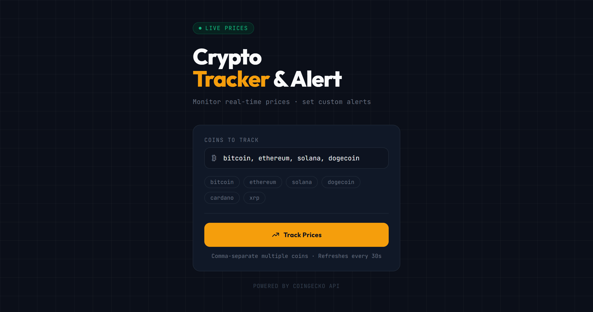
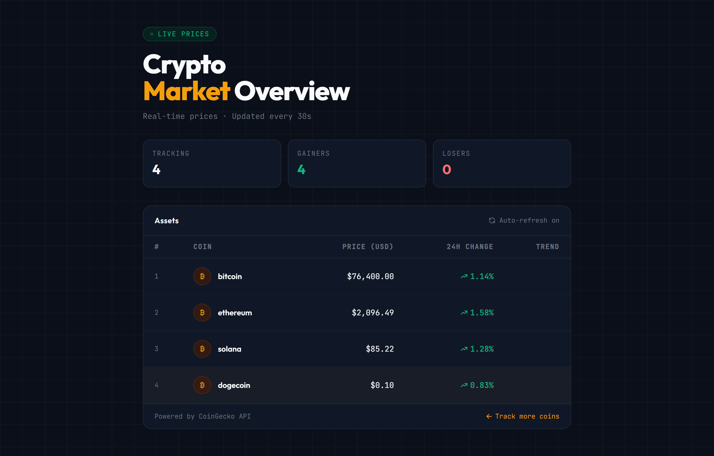

# 🪙 Crypto Tracker

A real-time cryptocurrency price tracker built with Spring Boot and Thymeleaf, powered by the CoinGecko API.

## Screenshots




## Features

- Track multiple cryptocurrencies at once
- Live USD prices via CoinGecko API
- 24-hour price change with up/down indicators
- Quick-pick buttons for popular coins
- Clean dark UI built with Tailwind CSS

## Tech Stack

- **Java 25**
- **Spring Boot 4.0.6**
- **Thymeleaf** — server-side templating
- **Tailwind CSS** — styling
- **CoinGecko API** — live price data
- **org.json** — JSON parsing

## Getting Started

### Prerequisites

- Java 25
- Maven

### Run the app

```bash
./mvnw spring-boot:run
```

Then open [http://localhost:8080](http://localhost:8080) in your browser.

### Usage

1. Type coin names (e.g. `bitcoin, ethereum, solana`) in the input field, or use the quick-pick buttons
2. Click **Track Prices**
3. View live prices and 24h change for each coin

> Coin names must match CoinGecko IDs (lowercase, e.g. `bitcoin` not `BTC`)

## Project Structure

```
src/
└── main/
    ├── java/com/cryptoTracker/cryptoTracker/
    │   ├── CryptoController/   # HTTP request handling
    │   ├── CryptoService/      # CoinGecko API integration
    │   └── model/              # CryptoCoin model
    └── resources/
        └── templates/          # Thymeleaf HTML templates
            ├── index.html
            └── result.html
Screenshots/
    ├── home.png
    └── result.png
```

## API Used

[CoinGecko Public API](https://www.coingecko.com/en/api) — free tier, no API key required (rate limited).
